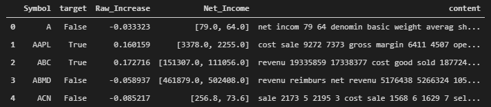
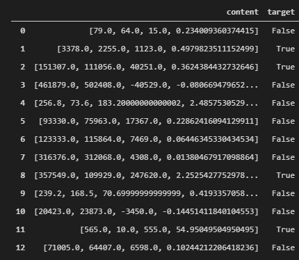

# Stock Prediction 2020

**Note that the description for plots and graphs are usually above the plot and graph.**

## File Organization
- main.ipynb: contains PDA, models, and results.
- data_scrape.ipynb: methodology of data scraping from EDGAR and yfinance. 
- images: folder for images for the README.md.
- presentation.pdf: quick presentation slide for summary and conclusion.
- README.md: quick readme file for summary and conclusions.

## Summary and Recommendations
Data are scraped from EDGAR and yfinance for 2010 and 2020. Models are made using the text data from the EDGAR 10-Q quarterly statements to correlation quarterly stock increase from yfinance.

No correlation are found so far with the "net income" scraping and text scraping of the 10-Q documents and stock movement.

It is found time series models may be useful in certain cases.

**For the future:**
1. Time series models may be useful for cyclic stocks, but do not trust them as soon has there are new highs or lows.
2. Develop better scraping techniques for the Statements.
3. Try developing models based on sentiments to see if that works better for stock price movement prediction.

## Data
Stock History: https://github.com/ranaroussi/yfinance

Financial Statements: https://www.sec.gov/edgar/searchedgar/companysearch.html

## Model 1: Text Data and Discrete Target
- Input: scraped text word stems with numbers.
- Humans can read it to compare magnitudes, this was a test to see check if NLP can do numerical reasons as well.
- Target: Has the stock increased by 2% or more in a quarter?
- No correlation.

## Model 2: Numerical Data and Discrete Target
- Input: [Current Quarter Net Income, Past Quarter Net Income, Abs Difference, Frac Difference.].
- Target: Has the stock increased by 2% or more in a quarter?
- No correlation.

## Model 3: Numerical Data and Numerical Target
- Input: [Current Quarter Net Income, Past Quarter Net Income, Abs Difference, Frac Difference.].
- Target: Stock Price
- No correlation.
- Loss = Abs Percentage Error.

## Model 4: Time Series – Cyclic Stock
- Input: 60 days of past stock prices for Ford.
- Target: tomorrow’s stock price.
- Right shifted.
- Loss = Mean Squared Error.

## Model 5: Time Series – Growth Stock
- Input: 60 days of past stock prices for Microsoft.
- Target: tomorrow’s stock price.
- Right shifted, and extremes out cut off.
- Loss = Mean Squared Error.

## Recommendations and Future Work
1. Time Series Models may be useful for cyclic stocks, but do not trust them as soon has there are new highs or lows.
2. Develop better scraping techniques for the Statements.
3. Try developing models based on sentiments to see if that works better for stock price movement prediction.
